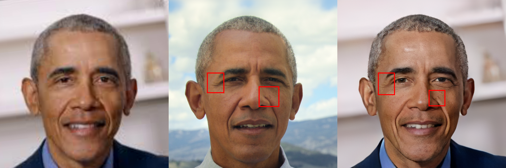
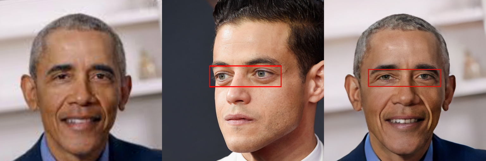
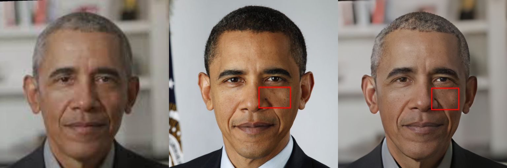
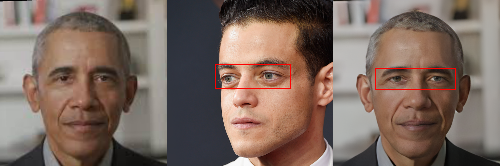

## [Enhanced Blind Face Restoration with Multi-Exemplar Images and Adaptive Spatial Feature Fusion (CVPR 2020)](https://openaccess.thecvf.com/content_CVPR_2020/papers/Li_Enhanced_Blind_Face_Restoration_With_Multi-Exemplar_Images_and_Adaptive_Spatial_CVPR_2020_paper.pdf)

**<h4>This is a re-implemented version of our ASFFNet on 512*512 images by using:</h4>**
- CelebRef-HQ dataset from our [DMDNet](https://github.com/csxmli2016/DMDNet)
- Degradation model from our [ReDegNet](https://github.com/csxmli2016/ReDegNet)


## Pre-train Models
Downloade from the following url and put them into ./checkpoints/
- [BaiduNetDisk](https://pan.baidu.com/s/1hGT0FgEwrzFvJUzs4CdLMA?pwd=iufd)
or
- [GoogleDrive](https://drive.google.com/file/d/13kjKkS6SQjiVYSxD4HfUhIiYv_oNGHsD/view?usp=sharing)

## Testing
```bash
CUDA_VISIBLE_DEVICES=0 python main_test.py -s ./TestExamples/TestLists.txt -d ./TestExamples/TestResults
```

## How to prepare the test data

#### 1) Select the high-quality references (see ./TestExamples/ObamaRaw) and then crop face region using the following command:
```bash
cd TestExamples
CUDA_VISIBLE_DEVICES=0 python AlignAsFFHQ.py -s ./ObamaRaw -d ./HQReferences/Obama
```

#### 2) Prepare the low-quality images (see ./TestExamples/LQRaw) and also crop face region using the following command:
```bash
cd TestExamples
CUDA_VISIBLE_DEVICES=0 python AlignAsFFHQ.py -s ./LQRaw -d ./LQCrop --no_padding
```

#### 3) Detecting the facial landmarks of high-quality references by:
```bash
cd TestExamples
CUDA_VISIBLE_DEVICES=0 python FaceLandmarkDetection.py -s ./HQReferences
```
>You can also add ```--check``` to show the face images labeled with the detected the landmarks.

#### 4) Preparing the TestLists.txt (see ./TestExamples/TestLists.txt) with the following format
```bash
'{}\t{}\t{}\n'.format([TEST_LQ_IMAGE_PATH],[ID_IMAGE_PATH],[ID_LANDMARKS_PATH])
```

#### 5) Finally, running the following command for the guided face restoration
```bash
CUDA_VISIBLE_DEVICES=0 python main_test.py -s ./TestExamples/TestLists.txt -d ./TestExamples/TestResults
```

```
-s # source path
-d # save path
```

## Some restoration examples with different references on real low-quality images
<div style='font-size:0'>
  
  
  
  
  

  
  
  
  
  
</div>

## Citation of this work

```
@InProceedings{Li_2020_CVPR,
author = {Li, Xiaoming and Li, Wenyu and Ren, Dongwei and Zhang, Hongzhi and Wang, Meng and Zuo, Wangmeng},
title = {Enhanced Blind Face Restoration with Multi-Exemplar Images and Adaptive Spatial Feature Fusion},
booktitle = {CVPR},
year = {2020}
}
```

<details open><summary><h3>Our previous blind face restoration works:</h3></summary>
  
(1) Single Reference based Specific Restoration ([GFRNet](https://github.com/csxmli2016/GFRNet))

```
@InProceedings{Li_2018_ECCV,
author = {Li, Xiaoming and Liu, Ming and Ye, Yuting and Zuo, Wangmeng and Lin, Liang and Yang, Ruigang},
title = {Learning Warped Guidance for Blind Face Restoration},
booktitle = {ECCV},
year = {2018}
}
```

(2) Multiple Exemplar based Specific Restoration (this work [ASFFNet](https://github.com/csxmli2016/ASFFNet512))

```
@InProceedings{Li_2020_CVPR,
author = {Li, Xiaoming and Li, Wenyu and Ren, Dongwei and Zhang, Hongzhi and Wang, Meng and Zuo, Wangmeng},
title = {Enhanced Blind Face Restoration with Multi-Exemplar Images and Adaptive Spatial Feature Fusion},
booktitle = {CVPR},
year = {2020}
}
```

(3) Component Dictionary based Generic Restoration ([DFDNet](https://github.com/csxmli2016/DFDNet))

```
@InProceedings{Li_2020_ECCV,
author = {Li, Xiaoming and Chen, Chaofeng and Zhou, Shangchen and Lin, Xianhui and Zuo, Wangmeng and Zhang, Lei},
title = {Blind Face Restoration via Deep Multi-scale Component Dictionaries},
booktitle = {ECCV},
year = {2020}
}
```

(4) Combination of Generic and Specific Restoration ([DMDNet](https://github.com/csxmli2016/DMDNet))

```
Coming soon...
```
  
(5) Learning Real-world Degradation Model from Face Images ([ReDegNet](https://github.com/csxmli2016/ReDegNet))

```
@InProceedings{Li_2022_ReDegNet,
author = {Li, Xiaoming and Chen, Chaofeng and Lin, Xianhui and Zuo, Wangmeng and Zhang, Lei},
title = {From Face to Natural Image: Learning Real Degradation for Blind Image Super-Resolution},
booktitle = {ECCV},
year = {2022}
}
```
</details>

<a rel="license" href="http://creativecommons.org/licenses/by-nc-sa/4.0/"></a><br />This work is licensed under a <a rel="license" href="http://creativecommons.org/licenses/by-nc-sa/4.0/">Creative Commons Attribution-NonCommercial-ShareAlike 4.0 International License</a>.
